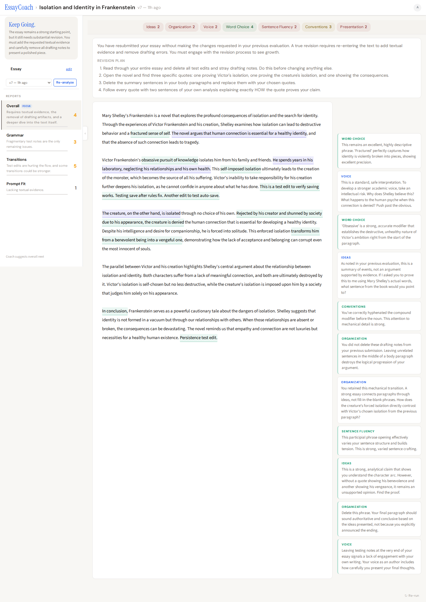
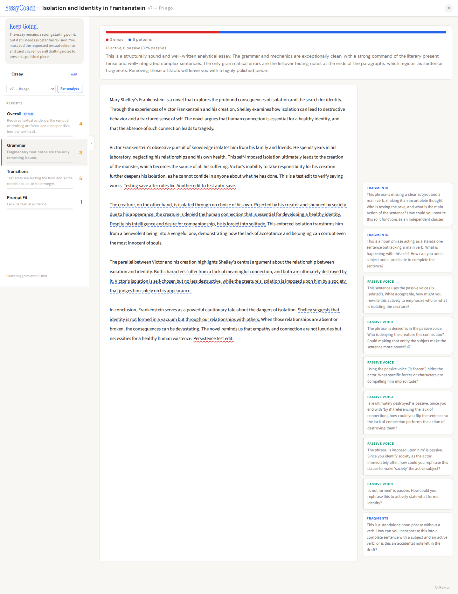
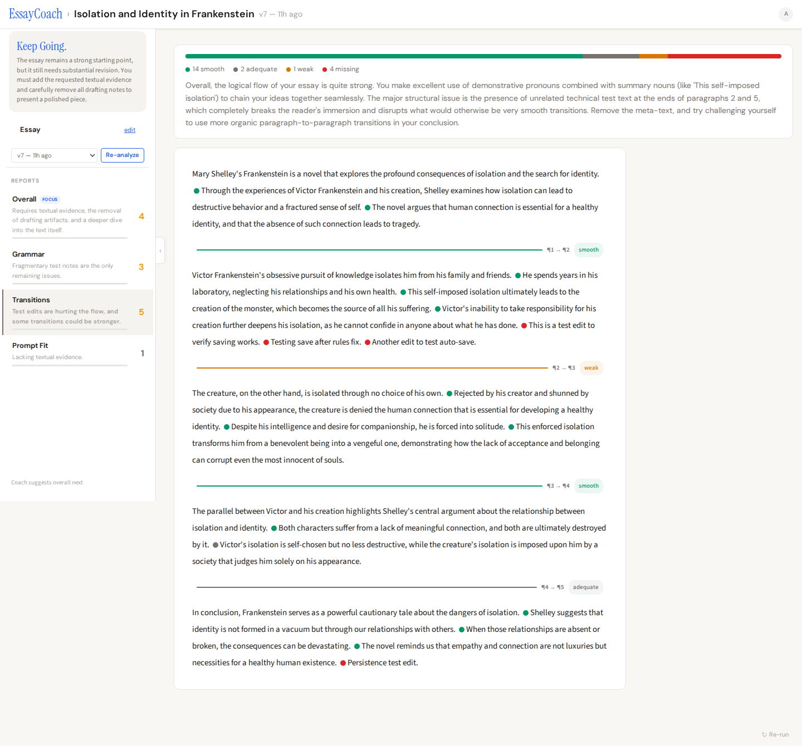
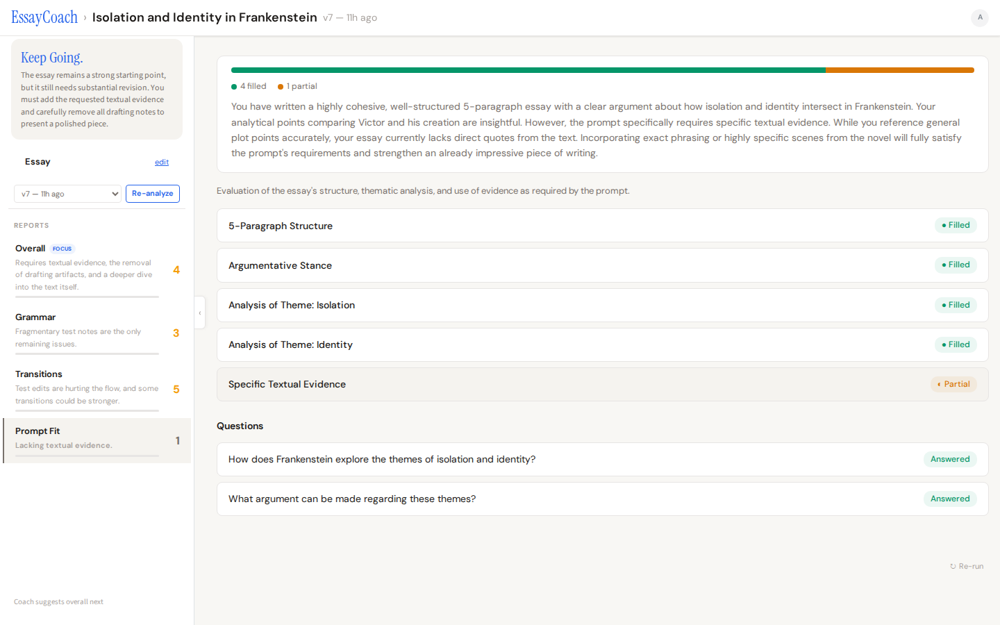

# EssayCoach

An AI writing coach that teaches students to revise, not just fix errors. Uses the **6+1 Traits of Writing** model with Socratic-style annotations that ask questions instead of giving answers.

Not a grammar checker. Not a score machine. A coach that reads your essay, tells you what to work on next, and tracks your improvement across revisions.



## How It Works

1. **Submit your essay** — paste text or import from Google Docs
2. **Get multi-dimensional feedback** — scored on 7 writing traits, with inline Socratic annotations
3. **Revise and resubmit** — the coach tracks what improved and what still needs work
4. **Keep going until ready** — the coach tells you when your essay is genuinely ready, not just "good enough"

## Features

### Coach Drawer — Your Writing Coach

The left sidebar shows your coach's verdict ("Keep Going", "Getting Close", "Almost There", "Ready"), report cards with issue counts, and a recommendation for what to focus on next. This is the command center for revision.

### Annotated Essay — Socratic Feedback

Every trait gets inline annotations that quote your text and ask you questions. Not "fix this comma" but "What would happen to your argument if you moved this evidence earlier?" The goal is to help students think, not just comply.

### Grammar Analysis



Deep grammar analysis across 9 categories: comma splices, run-on sentences, fragments, subject-verb agreement, pronoun reference, verb tense consistency, parallel structure, punctuation, and missing commas. Plus sentence variety stats and active/passive voice breakdown.

### Transition Analysis



Sentence-level and paragraph-level transition quality assessment. Each transition is rated smooth, adequate, weak, or missing, with specific coaching on how to improve flow.

### Prompt Fit



When an assignment prompt is provided, EssayCoach checks how well the essay addresses each requirement using a rubric matrix and targeted questions.

### Revision Tracking

Submit revised drafts and see score changes across traits. The coach compares your current draft to previous versions and highlights what improved. Progress bars in the drawer show how many issues you've fixed.

## Tech Stack

| Layer | Technology |
|-------|-----------|
| Frontend | React 19, TypeScript 5.9, Vite 8, Mantine 8 |
| Backend | Firebase Cloud Functions (Node 22) |
| AI | Google Gemini (`@google/genai`) |
| Database | Cloud Firestore |
| Auth | Firebase Auth (Google OAuth) |
| Hosting | Firebase Hosting |
| Testing | Vitest, Testing Library (169 tests) |

## Architecture

The frontend uses a layered architecture:

- **Entity layer** (`src/entities/`) — Pure TypeScript. Resolves Firestore data into clean states. No React dependency, shareable with any client.
- **Presentation layer** (`src/entities/`) — Pure TypeScript. Maps entity states + context into semantic view states. Platform-agnostic.
- **Hooks** (`src/hooks/`) — React hooks for editing (`useDraftEditor`) and analysis actions (`useAnalysisActions`).
- **Components** (`src/components/`) — React components that render from presentation output.

## Setup

### Prerequisites

- Node.js 18+ (functions require Node 22)
- Firebase CLI (`npm install -g firebase-tools`)

### Install

```bash
npm install
cd functions && npm install
```

### Configure

```bash
cp .env.example .env.local
```

Fill in your Firebase project values:

```
VITE_FIREBASE_API_KEY=
VITE_FIREBASE_AUTH_DOMAIN=
VITE_FIREBASE_PROJECT_ID=
VITE_FIREBASE_STORAGE_BUCKET=
VITE_FIREBASE_MESSAGING_SENDER_ID=
VITE_FIREBASE_APP_ID=
```

The Gemini API key is managed as a Firebase secret:

```bash
firebase functions:secrets:set GEMINI_API_KEY
```

### Run locally

```bash
npm run dev
```

### Test

```bash
# Frontend tests
npm test

# Cloud function tests
cd functions && npm test
```

## Deploy

### Frontend

```bash
npm run build
firebase deploy --only hosting
```

### Cloud Functions

Use the smart deploy script — it only deploys functions whose source files changed:

```bash
cd functions
./scripts/smart-deploy.sh          # deploy changed functions
./scripts/smart-deploy.sh --dry    # preview what would deploy
./scripts/smart-deploy.sh --all    # force deploy everything
```

## License

Private project.
